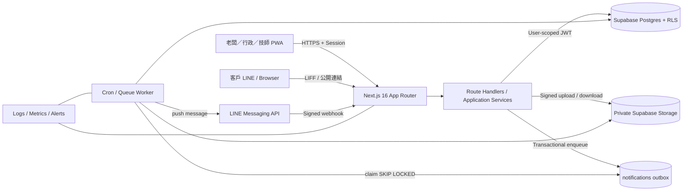

# Renoly v2 系統架構

> 狀態：可實作規格  
> 版本：2.0  
> 最後更新：2026-07-16

## 1. 文件目的

本文件定義 Renoly v2 的系統邊界、模組責任、資料流與部署方式。實作 API 前應同時閱讀：

- [API 規格](./api-spec.md)
- [資料庫規格](./database-spec.md)
- [安全規格](./security.md)

v2 是 clean-slate 設計：不相容 v1 schema、不提供舊資料遷移、不保留 v1 API。既有程式僅可重用視覺元件、互動模式、PDF 與圖片壓縮邏輯；不得把 v1 的 `projects/trades/payments` 資料模型直接搬入 v2。

## 2. 產品與架構原則

Renoly 面向 1–10 人、主要以 LINE 接案的小型工程與到府服務團隊。第一批產業模板可包含冷氣、水電、抓漏／防水，但核心模型必須通用。

產品的共同交易流程是：

```text
LINE／電話／網站詢問
  → 服務需求 service_request
  → 現勘或報價 quote
  → 專案 project（多日工程才需要）
  → 工單 work_order（每次到場）
  → 指派 assignment／檢查表／照片／事件
  → 追加工程 change_order
  → 階段請款 payment_milestone
  → 完工、保固、保養 maintenance_plan
  → LINE 回訪 notification
```

設計原則：

1. **一套通用核心，差異由模板表達。** 不為每個產業複製資料表。
2. **客戶不必安裝 App。** 客戶入口是 LINE OA 與受限公開連結；員工使用手機優先 PWA。
3. **人工核准是交易閘門。** AI 可產生草稿，不可自動送出報價、自動診斷、自動承諾時段或價格。
4. **所有營運資料皆有租戶。** 每筆業務資料必須屬於一個 `organization_id`，由 API 授權與 Postgres RLS 雙重隔離。
5. **財務與現場證據可稽核。** 已送出的報價版本不可原地修改；工單狀態、客戶簽認與通知皆寫入事件紀錄。
6. **可靠的非同步整合。** LINE 通知採 transactional outbox；webhook 先驗簽、去重、落庫，再非同步處理。
7. **預設保護個資。** 媒體皆為私有，公開連結可撤銷、可到期、只暴露必要欄位。

## 3. 系統全貌



### 3.1 執行元件

| 元件 | 責任 | 不得負責 |
|---|---|---|
| Next.js UI | 員工 PWA、客戶表單、報價／追加簽認頁 | 直接持有 service role、直接改動 domain table |
| Route Handler | 驗證、授權、DTO 驗證、呼叫 application service、統一錯誤格式 | 在 handler 內散落 SQL 或狀態轉換規則 |
| Application Service | use case、狀態機、權限、交易邊界、outbox enqueue | 回傳資料庫 row 給 UI、處理 JSX |
| Repository / RPC | 受參數化保護的資料存取、租戶條件、cursor pagination | 決定產品規則 |
| Postgres | 約束、FK、RLS、原子交易、audit event、outbox | 直接呼叫 LINE 等外部服務 |
| Storage | 私有原圖／縮圖／PDF | 公開 bucket 或以可猜路徑作授權 |
| Background Worker | 通知、回訪、縮圖、重試、webhook 後處理 | 回應互動式 HTTP request |

### 3.2 建議部署

- Web/API：Vercel，Node.js runtime；LINE webhook 不使用 Edge runtime，以確保 raw body 驗簽與 Node crypto 行為一致。
- DB/Auth/Storage：Supabase 專案，正式與 staging 完全分離。
- 排程：Vercel Cron 或外部 scheduler 每分鐘呼叫受保護的 worker endpoint；worker 以 `FOR UPDATE SKIP LOCKED` 批次 claim。
- 監控：Vercel logs + error tracker；資料庫開啟 `pg_stat_statements`（方案支援時）。
- 時區：資料庫與 API 一律 UTC `timestamptz`；顯示與商業日界線預設 `Asia/Taipei`，由組織設定覆寫。

## 4. 邏輯模組

### 4.1 Identity & Tenancy

- `auth.users`：Supabase Auth 的員工身分。
- `organizations`：店家／公司租戶。
- `memberships`：使用者在組織中的角色及狀態。
- v2 第一版員工登入使用 Supabase Auth email OTP／magic link；LINE OA 用於客戶入口與通知，不把客戶 LINE 身分當成員工權限。
- 後續若導入 LIFF 員工登入，必須先把 LINE 身分安全交換成 Supabase Auth session；不得以客戶傳來的 `line_user_id` 直接建立員工 session。

### 4.2 CRM & Intake

- `customers`：個人或公司客戶。
- `locations`：服務地址與現場聯絡資訊；同一客戶可有多個地址。
- `customer_line_identities`：客戶在特定店家 LINE channel 中的識別；同一 `line_user_id` 不可跨 channel 當成同一人。
- `assets`：位於地址中的設備或標的，例如冷氣、熱水器、抽水馬達；油漆、防水可不使用。
- `service_requests`：從 LINE、電話、Web 或介紹進來的需求與初步分流。

### 4.3 Sales

- `service_catalogs` / `service_catalog_items`：店家自己的服務價目與模板。
- `quotes`：報價單聚合與對外編號。
- `quote_versions`：可送出的版本快照；只有 draft 可編輯。
- `quote_items`：版本中的品項；保留成本與售價快照。
- `public_access_tokens`：客戶查看／接受／拒絕的短期能力 token，只存雜湊。

### 4.4 Delivery

- `projects`：多日、多工種工程的容器；單次到府服務可省略。
- `work_orders`：每次到場或可獨立驗收的工作單位，是所有產業共同核心。
- `assignments`：工單與技師的多對多關係。
- `checklist_templates` / `work_order_checklists`：依產業或服務項目建立的快照式檢查表。
- `photos`：施工前、施工後、異常、收據等媒體 metadata；檔案在私有 Storage。
- `events`：append-only 業務稽核事件。

### 4.5 Revenue & Retention

- `change_orders` / `change_order_items`：追加／追減與客戶簽認。
- `payment_milestones`：階段請款與人工收款紀錄；v2 不儲存信用卡或銀行帳號，不等同金流系統。
- `maintenance_plans`：設備／地址／客戶層級的定期保養規則。
- `notifications` / `notification_attempts`：transactional outbox、重試與供應商回應。

### 4.6 LINE Integration

- `line_channels`：組織與 LINE OA channel 的非敏感設定、連線狀態。
- `private.line_channel_credentials`：加密後的 channel secret 與 access token。
- `line_webhook_events`：原始 webhook 去重、處理狀態與有限期 payload。
- 一個組織第一版最多一個 active LINE channel；schema 保留多 channel 能力。

## 5. 程式碼分層與目錄

建議逐步建立以下 v2 目錄，不與 v1 `actions.ts` / `queries.ts` 混用：

```text
src/
├── app/
│   ├── (staff)/                       # 員工 PWA
│   ├── (public)/                      # intake / quote / change-order
│   └── api/v2/
│       ├── organizations/[organizationId]/...
│       ├── public/...
│       ├── webhooks/line/[channelId]/route.ts
│       └── internal/workers/...       # secret-protected cron endpoints
├── server/
│   ├── auth/                          # session、CSRF、RBAC
│   ├── api/                           # response、problem details、cursor
│   ├── db/                            # user/admin clients、repositories
│   ├── domain/                        # entities、state machines、errors
│   ├── services/                      # application use cases
│   ├── integrations/line/             # signature、client、templates
│   ├── storage/                       # signed URL、validation
│   └── observability/                 # logger、metrics、request id
├── schemas/                           # 共用 Zod request/response schema
└── types/generated/database.ts        # Supabase CLI 產生；不可手改

supabase/
├── migrations/                        # v2 timestamped migrations only
├── seed.sql                           # demo organization，禁止真實個資
└── tests/                             # pgTAP / RLS tests
```

依賴方向固定為：

```text
route/UI → application service → domain + repository interface
repository implementation → Supabase/Postgres
worker → application service → repository + integration adapter
```

Domain 與 application service 不 import React、Next.js request objects 或 Supabase client。

## 6. 請求與交易模式

### 6.1 員工 API

1. middleware 讀取 Supabase session cookie；無 session 回 `401`。
2. route 解析 `organizationId`，確認 active membership。
3. 使用 Zod 驗證 body/query/params。
4. application service 驗證角色、當前狀態與資源租戶。
5. 單表簡單查詢可走 user-scoped Supabase client；跨表寫入一律呼叫 transaction RPC。
6. DB RLS 再次驗證 `auth.uid()` 與 `organization_id`。
7. 回傳 DTO、ETag、request id；不回傳內部 row 或秘密欄位。

### 6.2 客戶公開操作

1. URL 帶 256-bit random token；DB 僅存 `sha256(token)`。
2. server 以 constant-time compare／等值雜湊查詢，檢查 scope、到期、撤銷及使用次數。
3. 只載入該 token 所指向的單一資源，使用專用 sanitized DTO。
4. 接受／拒絕需 `Idempotency-Key`，並在同一交易鎖定版本、寫入狀態與事件。
5. 客戶可看到售價與條款，永遠看不到 `unit_cost_minor`、內部備註、成員電話或其他客戶資料。

### 6.3 報價送出

在單一 DB transaction 中：

1. `SELECT ... FOR UPDATE` 報價聚合與 draft version。
2. 驗證至少一個品項、金額一致、客戶聯絡方式存在。
3. 將 version 設為 `sent` 並固定 totals；報價聚合設為 `sent`。
4. 撤銷前一版尚未使用的公開 token，建立新 token hash。
5. append `quote.sent` event。
6. insert `notifications(status='pending')`，以 `dedupe_key` 防重。
7. commit 後由 worker 發送，API 不等待 LINE。

外部發送失敗不回滾報價狀態；通知顯示 `failed` 並可重試。再次送出同一版只建立新的 delivery attempt，不複製報價版本。

### 6.4 工單狀態轉換

一般 `PATCH work-order` 不可改 `status`。狀態只能經 `/transitions` use case，在交易中：

1. 鎖定 work order，檢查 `If-Match`。
2. 驗證角色、assignment、合法 transition 與必要欄位／照片／檢查項。
3. 更新狀態、對應 timestamp 與 `lock_version`。
4. append event。
5. 需要客戶通知時 enqueue outbox。

### 6.5 媒體上傳

```text
POST /photo-uploads → DB 建 pending photo + 短效 signed upload URL
    ↓ browser direct PUT
POST /photos/{id}/complete → 驗證 object metadata / magic bytes / size
    ↓ worker normalize、移除 EXIF、產縮圖
photo.status = ready → API 才可簽發短效 read URL
```

上傳失敗／逾時的 `pending` object 由每日 cleanup job 移除。檔名與原始名稱不作授權判斷。

## 7. 非同步工作與可靠性

### 7.1 Transactional outbox

- 任何需要通知的 domain write，必須在同一 transaction insert `notifications`。
- worker claim：`pending` 或可重試 `failed`、`scheduled_at <= now()`，且 `approval_status IN ('not_required','approved')`，使用 `FOR UPDATE SKIP LOCKED`。
- claim 後設 `processing`、`locked_at`、`locked_by`；每批最多 50 筆。
- 成功寫 provider message id 與 `sent_at`。
- 可重試錯誤採 full-jitter exponential backoff：1、2、5、15、60 分鐘，最多 5 次。
- 4xx 永久錯誤（無效 recipient、被封鎖）直接 `failed`；429/5xx/timeout 可重試。
- watchdog 將鎖超過 5 分鐘的 `processing` 恢復為 `pending`。
- `dedupe_key` 在 organization + channel 範圍唯一，防止 transition 重播造成重複通知。

### 7.2 LINE webhook inbox

- 驗證 raw body 的 `X-Line-Signature` 後才 parse JSON。
- 以 `(line_channel_id, webhook_event_id)` 唯一約束去重；缺 event id 時以 canonical payload hash 作短期 fallback。
- 收到後只做驗簽、insert inbox、回 `200`；目標 p95 < 500 ms。
- worker 再下載訊息圖片、配對客戶、建立 service request 或訊息事件。
- payload 只保留處理所需內容，90 天後刪除；媒體須在可下載期間立即搬入私有 Storage。

### 7.3 排程工作

| Job | 頻率 | 功能 |
|---|---:|---|
| notification-dispatch | 每分鐘 | 發送 outbox |
| webhook-process | 持續／每分鐘 | 處理 LINE inbox |
| maintenance-due | 每日 09:00 組織時區 | 建立待審核回訪通知；不得直接自動承諾服務 |
| payment-overdue | 每日 | 將到期且未付 milestone 標成 overdue |
| media-cleanup | 每日 | 清除過期 pending／deleted media |
| token-cleanup | 每日 | 清除 expired public tokens/idempotency records |

所有 job 需可重入、可重跑，以唯一鍵或 idempotency key 保護。

## 8. 一致性與併發

- Aggregate roots：`service_requests`、`projects`、`work_orders`、`quotes`、`change_orders`、`maintenance_plans`。
- 可被多人修改的 root 皆有 `lock_version integer`；每次 write `lock_version = lock_version + 1`。
- API 以強 ETag `ETag: \"{lockVersion}\"` 回傳，mutation 要求 `If-Match`；缺少回 `428`，過期回 `412`。
- 所有跨表業務寫入使用 Postgres function transaction，不以多次 client insert 模擬交易。
- 編號使用 `document_sequences` 在 transaction 中遞增，格式如 `WO-202607-000123`；編號僅供人讀，不作主鍵。
- 金額全部使用整數 `*_minor`，TWD 以元為 minor unit；數量使用 `numeric(12,3)`，禁止 float。
- 已送出的 version/item 是快照；修訂一律 clone 成下一版。

## 9. 效能與容量基準

第一年容量假設：100 組織、1,000 員工、100,000 客戶、300,000 工單、3,000,000 張照片 metadata。

目標：

- 一般讀取 p95 < 400 ms（不含外部 LINE）。
- 一般 mutation p95 < 700 ms。
- dashboard 查詢最多 5 次 DB round trips，禁止 N+1。
- list API 使用 cursor，預設 20、上限 100；禁止任意 offset 深翻頁。
- 讀取只選 DTO 所需欄位；照片 list 不產生原圖 URL，縮圖 signed URL 可批次簽發。
- 高頻 index 以 `(organization_id, status, created_at desc, id desc)` 為基礎，詳見資料庫規格。

## 10. 可觀測性

每個 HTTP request 產生或接受可信的 `X-Request-ID`，並回傳同值。結構化 log 至少包含：

- `timestamp`, `level`, `requestId`, `route`, `method`, `status`, `durationMs`
- authenticated request 的 `userId`, `organizationId`（不可含姓名／電話）
- background task 的 `job`, `recordId`, `attempt`
- external API 的 provider、status、latency、provider request id

禁止記錄：session、JWT、LINE secret/token、public token、完整 webhook body、完整地址、電話、email、照片 signed URL。

必要指標：

- API error rate / latency
- webhook signature failures / inbox backlog
- outbox pending age / send success / retry / permanent failure
- RLS denial / authorization denial
- storage pending age / processing failures
- DB connection usage / slow query / lock wait

告警門檻初始值：最老 pending notification > 5 分鐘、webhook backlog > 100、5xx > 2% 持續 5 分鐘、同組織連續 20 次簽章失敗。

## 11. 環境與發佈

| 環境 | 用途 | 資料規則 |
|---|---|---|
| local | 開發、seed demo | 僅假資料 |
| staging | migration、整合、UAT | 禁止複製正式個資；獨立 LINE 測試 channel |
| production | 真實營運 | 最小權限、備份、監控、rotation |

發佈順序採 expand/contract：

1. migration 先增加向後相容欄位／表／index。
2. staging 執行 schema、RLS、contract、integration test。
3. production migration；確認 lock time 與資料校驗。
4. deploy app／worker。
5. 指標穩定後才移除舊欄位。v2 初始建置沒有 v1 migration，但後續 v2 migration 仍遵循此規則。

每個 migration 必須可在空資料庫從頭依序套用；不可只提供 Supabase Dashboard 手動 SQL。

## 12. 明確不做

v2 MVP 不包含：

- 原生 iOS／Android App
- 完整 POS、發票、會計總帳、薪資、庫存與採購 ERP
- 路線最佳化或即時 GPS 追蹤
- 自動故障診斷、自動定價、自動對客承諾
- 儲存卡號或直接處理信用卡
- 多幣別結算與複雜稅務
- v1 schema 相容層或舊資料匯入程式

## 13. 架構決策紀錄（ADR 摘要）

| ADR | 決策 | 理由 |
|---|---|---|
| 001 | v2 clean-slate，API prefix `/api/v2` | 舊 DB 已刪除，避免錯誤相容成本 |
| 002 | `work_order` 為共同核心，`project` 可選 | 同時支援單次到府與多日工程 |
| 003 | 所有 domain data 帶 `organization_id` + composite FK | 從 DB 層阻止跨租戶關聯 |
| 004 | 員工流量統一經 Next.js API，DB 保留 RLS | 一致 DTO/狀態機，並有 defense in depth |
| 005 | 報價／追加使用 immutable versions | 可稽核、避免客戶簽認後內容漂移 |
| 006 | LINE 採 inbox/outbox | webhook 重送與通知失敗不破壞交易 |
| 007 | 私有 Storage + signed URL | 避免施工照片與地址資訊外洩 |
| 008 | 人工核准 AI 草稿 | 降低錯誤診斷、錯價與錯誤對客承諾風險 |
